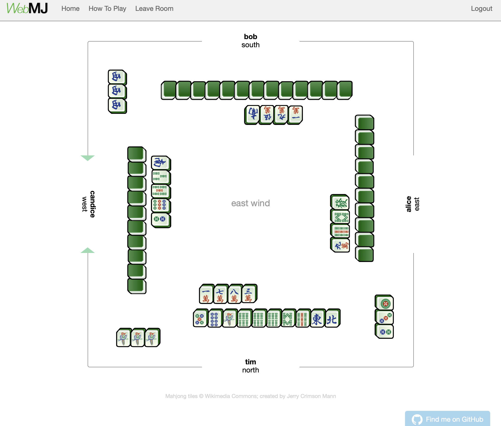
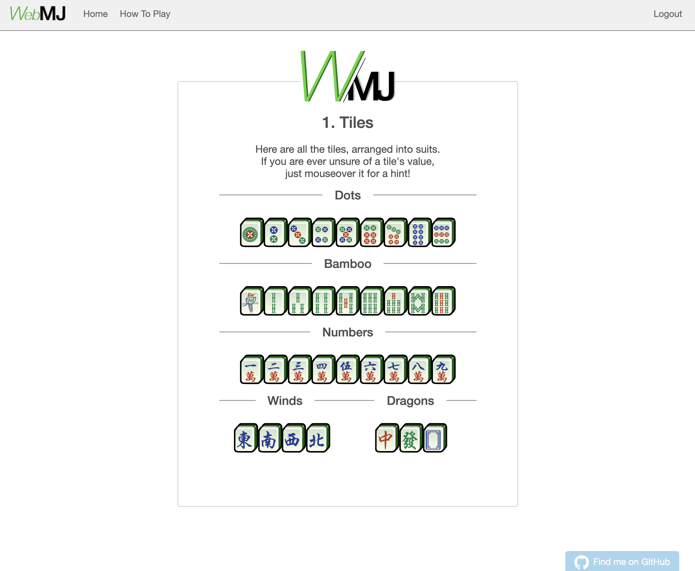

# WebMJ: A WebApp to play Mahjong

A simple html based way to play Mahjong online!
WebMJ uses a `Python-Flask` backend with asynchronous websocket communication via `Socket.IO`.

Deployed on [Heroku](https://web-mj.herokuapp.com)!

## Screenshots:

---

## Requirements:
- `Python 3.6`
- `Flask`
  - `Flask-Socketio`
  - `Flask-Login`
  - `Flask-SQLAlchemy`
- `NumPy`

## TODO:
- Other players' tiles not displaying properly after set event (fixed?)
<!-- - Implement 'addgong' check to every turn  *(added, needs testing)* -->
<!-- - Current 'addgong' dialogue lingers after win event, need to reset -->
- Handle win events:
  <!-- - ~~(calculate points for winner)~~ -->
  <!-- - ~~*Show winning points on client side~~ -->
  - Add overall point/score tally
    - Log player that discarded winning tile,
    - Handle 'self-draw' events separately
    - Logic for self-draw penalties (e.g. after a player shows 4 sets)
  - Only allow wins that fulfill some minimum score
- Action indicators needs more stylizing 
- Add flowers
<!-- - Logic to handle running out of tiles *(added, needs testing)* -->
<!-- - Add screenshots to readme -->
